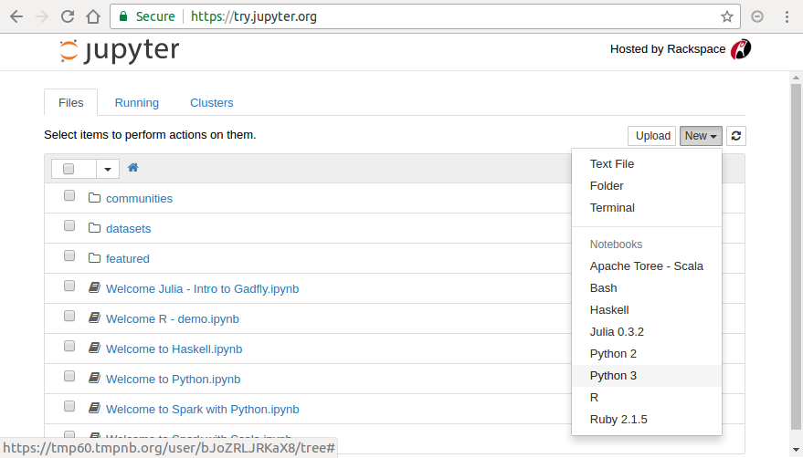
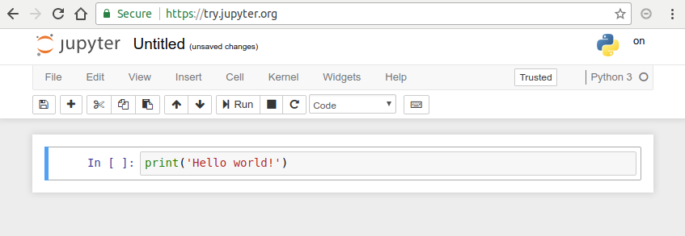
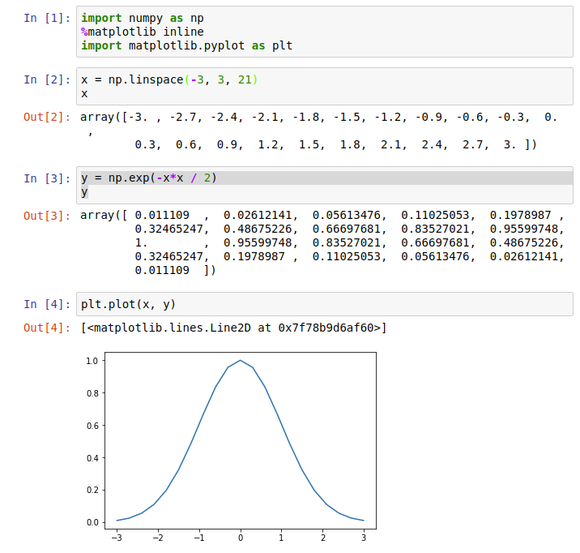

=================
はじめに Preface
=================

  **吉沼幹朗  Mikirou YOSHINUMA**

  **核融合科学研究所**

汎用プログラミング言語のひとつであるPythonは、
多くの環境で誰でも利用でき、簡単な記述で様々なことができるため利用者が増えています。
プラズマ・核融合分野においても利用者を見かけるようになり、Pythonを使ってみよう
と考えている人も多いのではないでしょうか。
本章では、Pythonがどのような言語であるかを手短に説明します。

keywords: Python, set-up, guideline

Pythonとは
-------------------------------

プログラミング言語PythonはGuido van Rossum氏によって作られました。
Pythonと書いて、「パイソン」と呼ばれています。
現在はPythonソフトウェア財団で管理、開発されています。
数年前、すでに海外において多くのユーザーを獲得していたPythonですが、
日本においては、和文の入門書や解説書の数も少なく、周囲で利用しているユーザーも少ない状態でした。
近年、大量に取得されたデータ（ビッグデータ）の統計解析やそれを用いた
機械学習といった技術が広まるとともに、
日本においても、その解析手法の開発環境としてPythonのユーザーが増加してきたと思われます。
最近では、書店のパソコン関連の棚にもタイトルにPythonが入った書籍を見かけるようになり、
入門書も数多く出版されています。
また、インターネット経由でアクセスできる情報も充実しており、
多くのサンプルコードや日本語による解説を見ることができます。

プラズマ・核融合分野においても、Pythonを利用している人を見かけるようになりました。
そろそろ使ってみようと考えている人もいることでしょう。
はじめようと思うけれど、これまで馴染んできたFortranやC言語といったコンパイラとは異なる点に
不安を覚えているかもしれません。
本講座は、はじめてみようかと思っている人の背中を押して、実際にはじめてもらうことを目指しています。
Pythonという言語を短く説明すると「誰でも利用できる書きやすく読みやすい汎用のプログラミング言語、だけど簡単」となります。

Pythonは誰でも利用できます
-------------------------------------------

Pythonは無料で利用できるので、どなたでもインストールしておくことができます。
また、Windows、 Linux、 OS Xといった主要なプラットホームで利用できます。
これは、共同研究をする上で非常に重要なことです。
ある解析プログラムを渡して実行をお願いしても、
その実行環境のライセンスを相手が持っていない場合がしばしばあるためです。
Pythonで記述されたスクリプトは、主要なプラットホーム上で誰でも実行できます。

Pythonは書きやすい言語です
--------------------------------------

Pythonは、実行時の値によって変数の型が決められる（動的型付け）言語です。
変数の型を指定する必要がないため、処理内容に集中して書くことができます。
また、インタラクティブな実行環境を持っているため、
処理の記述（プログラム作成）と適用結果の表示を繰り返して解析を進めていくことが容易です。

Pythonは読みやすい言語です
--------------------------------------

Pythonでは、ブロック構造をインデントを用いて表現するため、読みやすい構造をもった書式が維持されます。
ブロック構造とは、条件つきの処理、繰り返し処理や関数定義などの範囲のことです。
このことは自由形式の言語に慣れている人には、書きづらいと感じるかもしまません。
インデントのずれによって正常に動かなくなることを不安に感じる人も多いと思います。
しかし、読み易さを損なわないためには、どの言語であっても一貫したインデントは必要です。
また、インデントのずれについては、
TABキーによって空白が入らないようにエディタを設定するだけで防ぐことができます。
そして、Pythonでは技巧的な短い（パズル的で楽しい）記述よりも、分かりやすい記述が選ばれます。
このような特徴から、インターネット上の解説やスクリプト、さらには付属のライブラリまで、
読んで理解することが比較的容易です。

Pythonは汎用プログラミング言語です
------------------------------------------------------------

Pythonは汎用のプログラミング言語なので、データ解析のみならず、テキストファイルの処理、グラフィカルユーザーインターフェース(GUI)の作成、ネットワークプログラミング、画像処理、ゲーム作成などパソコンで行われるほとんどのことに利用できます。
また Pythonプログラムは、手続き的に記述することも、
オブジェクト指向や関数型と呼ばれるような技法で記述することも可能であるため、
そのようなプログラミング技法を理解することの助けにもなるでしょう。
プログラミング入門用の言語としてもおすすめできます。

だけど簡単
-------------------------------

Pythonが人気を得た理由のひとつとして、多くの有用なモジュールの存在があると思われます。
モジュールは、パッケージと呼ばれる機能がつまったモジュールファイルの集まりです。
それらを自分のPython環境にインストールすることによって、
プログラムを開発しなくても必要な処理が行えるようになるものです。
Pythonに標準で備わっているモジュールでも多くのことができますが、
外部から提供されるモジュールによってさらに簡単にできるようになります。
たいていの場合、行いたい処理に応じたモジュールを利用することになります。
プラズマ・核融合分野においては、
数値計算や解析のための優れたモジュール(NumPy , ``SciPy`` , Matplotlib , ``pandas`` )や、
それらのモジュールを便利に利用するための対話的な環境( ``jupyter`` )
が利用されています。

Pythonの欠点
------------------------------------

よいことばかりのように書いてしまいましたが、Pythonは万能ではありません。
C言語やFortranといったコンパイラ言語を使っている方は、その実行時の速度に不満を持つかもしれません。
大規模な数値計算やシミュレーションの主となる部分にPythonを利用することは考えるべきではないでしょう。
コードに依存しますが、動的な型付けを行うインタプリタである
Pythonは大雑把に言ってC言語と比べて数十倍遅いでしょう。
しかしながら、実験データの解析処理のうちインタラクティブに進められるような時間スケールの処理については、
記述しやすいPythonを用いる方が素早く結果を得られることがあるでしょう。
PythonからC言語やFortranのコードを利用することができますので、
時間がかかる処理をC言語やFortranに置き換えることも可能です。
Pythonは、それらの処理へのデータ入出力を担当することができるでしょう。
そうすることで、C言語やFortranでは記述するのが煩わしい入出力の部分を、
ユーザーにとって便利なものにすることが容易になります。

Pythonを試してみよう
-----------------------

Pythonがどのような言語かイメージしていただけたでしょうか。
Pythonは、以下のような場面で便利に利用できるかと思います。

+ 電卓代りにちょっとした計算をしたい。
+ シェルスクリプトで解析処理を制御しているけど、より複雑な分岐制御をしたい。
+ 様々なデータファイルから必要なデータを取り出して、解析したい。
+ 解析処理プログラムをFortranで書いたけど、入力データファイルの書式がバラバラだ。書式を合わせたい。
+ ネットワーク経由で情報を取得したい。サーバー上の解析プログラムを自動で実行したい。
+ 解析結果をグラフで描画しながら解析を進めたい。
+ すばやく解析処理を書いて、手法を可能性を確認したい。

第2章にて、Pythonを使えるようにする方法が説明されますが、
ここでは、環境を整える前にPythonを試していただきたいと思います。
ウェブブラウザで
https://try.jupyter.org/
にアクセスしてください。
:numref:`try_jupyter` のようなページが表示されると思います。
このページは、第2章で紹介されるJupyter-notebook という
対話型のPython開発環境を体験することのできるサービスです。
右上の New ボタンから Python 3 を選択すると、
新しいノートブックファイルが作成され、図のような新しいノートブックページが開かれます。

   http://try.jupyter.org のトップ画面。右上の New ボタンから新しいノートブックファイルを作成できます。

   新しいノートブックファイルを作成したときの様子。
   ひとつ目のセルに ``print('Hello world!')`` と入力しています。

Jupyter-notebook では、セルと呼ばれるボックス内にスクリプトを入力します。
まずは :numref:`hello_world` にあるように、ひとつ目のセルに以下を入力してみましょう。

.. code-block:: python

  print('Hello world!')

このセルを実行するためには、再生ボタンを押すか、
キーボードの Shift + Enter を同時に押下してください。

実際に実行すると、入力したセルの下に "Hello world!" が表示されると思います。
C言語などのコンパイル言語でこのような命令を実行するためには、
まずは完全なソースコードを作成し、コンパイルして実行ファイルを生成することが必要です。
一方でインタープリタ言語である Python ではコンパイル作業が不要であるほか、
開発途中のソースコードでも途中まで実行できる点が特徴です。

次に :numref:`try_plot` のように以下の内容を入力してみてください。

.. code-block:: python

  import numpy as np
  import matplotlib.pyplot as plt

.. code-block:: python

  x = np.linspace(-3, 3, 21)
  x

.. code-block:: python

  y = np.exp(-x*x / 2)
  y

.. code-block:: python

  plt.plot(x, y)

上記では、ベクトル変数 x と y を定義し、
その内容を画面に表示したあと、グラフに描画しています。
詳しくは、次号の NumPy や Matplotlib の説明によって明らかになるでしょう。

   ノートブックファイルの実行例

Pythonではこのように、手早くコードを作成・実行し結果をすぐに可視化できます。
このような特徴は、試行錯誤しなが進める研究活動を行うのに効果的なだけでなく、
プログラムスキルを身に付けるためにも非常に効果的だと思います。
もちろん、このような対話的な環境ではなく、
一般的な言語を実行するようにコマンドでの実行もできます。
ぜひ第2章を読んで、開発環境をあなたのPCにインストールしてください。

まとめ
---------------

Pythonをはじめてみようという気分になってきたでしょうか。
Pythonをはじめたばかりの方からは、どのようなときにどのようなモジュールを利用したら
よいか判断できない、モジュールの使い方が分からないという声を聞きます。
そこで本講座では、プラズマ・核融合分野でよく利用されている環境やモジュールを、
みなさんが使い始めることができるように紹介していきたいと思います。

本講座は、計3回の講座で、今回は「Pythonスタートアップガイド」として、
AnacondaというPythonの実行環境のインストール方法を Windows、Linux、OS Xを利用の方に向けて説明します。
その後、Pythonスクリプトの作成方法、実行方法とJupyterという対話的な環境を紹介し、
それを用いてPythonの基本的な文法を説明します。
次号では、「Pythonによる科学技術計算」ということで、核融合分野に限らず、科学技術計算に利用されるモジュールである NumPy 、SciPy 、およびその結果をグラフとして描画するのに便利な Matplotlib の使い方が説明されます。
また、機械学習を実行するモジュール scikit-learn についても紹介されます。
三回目では、「Pythonの活用事例」として、
LHD実験やJT-60SA実験においてどのようにPythonが利用されているかを紹介していただきます。
