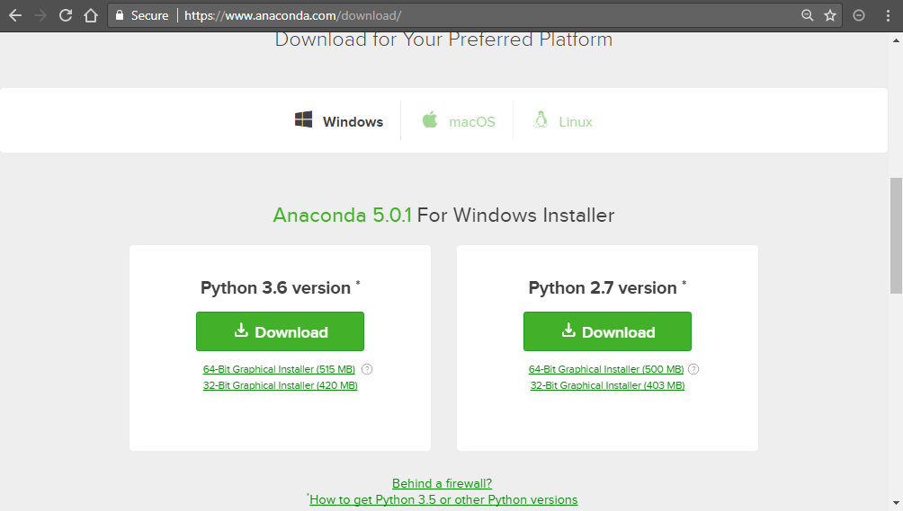
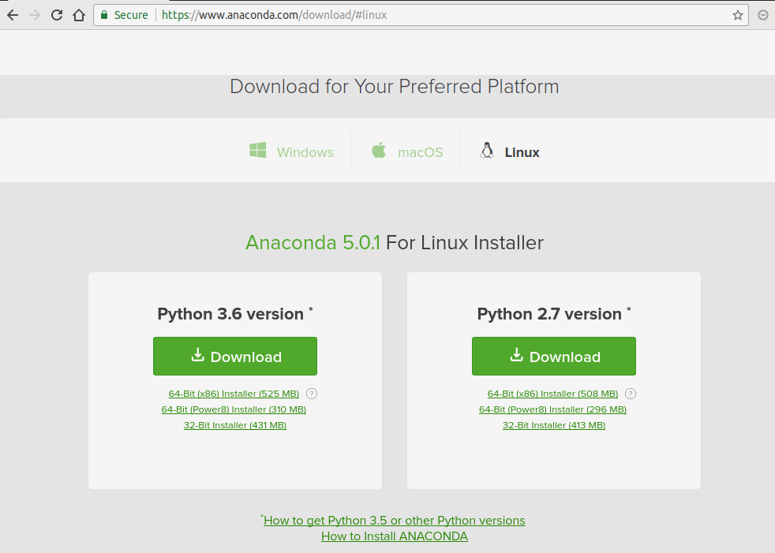

概要
=====

Pythonは簡単に始めることのできる言語である。
開発環境をPC内に構築することも容易であり、
これまでプログラミングにほとんど触れたことのない人でも数クリックで環境構築を完了できる。
ここではPython開発環境の構築法を述べた後、少し発展的な話題として、
外部パッケージを新しくインストールする方法、Python開発環境を一つのPC内に複数構築する方法について述べる。

Python開発環境の構築
=======================

これまで、プログラミング環境の構築に手間取って、何時間もかけた記憶のある人も多いと予想する。
しかしPythonはそうではない。
本講座は「今日から始めるPython」と題している通り、
今日からPythonプログラミングを始めることを趣旨としている。
忙しい研究者の方々の時間を、環境構築などにかけてはいられない。セットアップは5分で終わらせよう。

この節では、
Windows, Mac および Linux 各オペレーティングシステム（OS）上での
Python開発環境の構築法について述べる。
開発環境をセットアップする方法も色々あるが、
ここでは非常に簡単で人気のある Anaconda distribution という統合パッケージを利用することにする。

なお、Anaconda distribution の特徴や詳細については次節以降で述べる。
Pythonを触ったことのない初心者は、環境構築が完了すれば以降は飛ばして、
次章の Jupyter-notebook を用いたPython入門に進んでもよい。

Windowsでの開発環境構築
---------------------

Anaconda distribution ダウンロードページ https://www.anaconda.com/download
にアクセスし、Windows版 Anaconda をダウンロードする。
なお、（残念ながら）Pythonにはバージョン2系（現在の最新は2.7）と3系（現在の最新は3.6）
という大きく2つのバージョン系列がある。
現在も開発続いているパッケージはほとんどが3系に対応しているため、こちらを利用することを勧める。

   https://www.anaconda.com/download 画面のスクリーンショット。

  download 画面のスクリーンショット。OS、環境に合わせてダウンロードするdistributionを選択する。

OSのbit数などに合わせたバージョン（現在では64bitシステムが一般的である）をダウンロードする。
ダウンロードされたインストーラをクリックすることでインストールを開始できる。

.. figure:: figs/anacond_setup1.png
   :scale: 50 %
   :alt: download anaconda

.. figure:: figs/anacond_setup2.png
  :scale: 50 %
  :alt: download anaconda

  ダウンロードしたインストーラを実行している様子。

.. figure:: figs/anacond_setup3.png
 :scale: 50 %
 :alt: download anaconda

  インストール終了時のスクリーンショット

  インストールが完了したことを知らせる画面のスクリーンショット

詳細は後述するが、Anaconda ではPython開発環境をユーザー固有のもにするか
PC内で共通にするか選ぶことができる。
他のユーザと環境が衝突しないよう、個人ごとの環境を構築すること（上図のJust Meを選択）を勧める。
インストーラが終了したあと、
Anaconda Prompt や Jupyter Notebook というアプリケーションがスタートメニューに登録されていれば
Python開発環境の構築は終了である。

Macでの開発環境構築
---------------------

Under construction

Linuxでの開発環境構築
-----------------------

Anaconda distribution ダウンロードページ https://www.anaconda.com/download にアクセスし、
Linux版 Anaconda をダウンロードする。

 Linux版Anacondaのダウンロード画面

Anaconda3-5.0.1-Linux-x86_64.sh というようなファイル名
（5.0.1 などの数字はAnaconda distributionのバージョン番号）
のスクリプトファイルがダウンロードされる。以下のコマンドを用いて、実行権限を付与して実行する。

.. code-block:: bash

  chmod +x Anaconda3-5.0.1-Linux-x86_64.sh
  ./Anaconda3-5.0.1-Linux-x86_64.sh

なお Linux 版 Anaconda でも、OSのPython環境と切り離した環境を構築することが可能である。
そのため上記コマンドは管理者でなく一般ユーザーの権限で実行するのが望ましい。
ライセンスに同意すれば、インストールが始まる。

.. figure:: figs/anacond_setup1_linux.png
 :scale: 50 %
 :alt: setting up anaconda

 ターミナルからインストーラを実行している時の様子。ライセンス同意書に同意することでインストールが始まる。

.. figure:: figs/anacond_setup2_linux.png
 :scale: 50 %
 :alt: adding anaconda to PATH

 Anaconda を Path に加えるかを問われている画面。ここで yes を選択しておく。

最後に Anaconda を Path に加えるか問われる。ここで yes を選択しておくこと。
これによりターミナルからPython を実行する際にAnacondaのPythonが優先して選択されることになる。
なお、ディストリビューションによっては 一度ログインし直す必要があるかもしれない。

以上でLinuxにおけるPython開発環境の構築は完了である。

Anaconda distribution
===========================

上で紹介した Anaconda distribution は Anaconda Inc が開発する
Python および R 開発環境を提供するオープンソース・ソフトウェアである。
3-clause BSD License で提供されており、自由に利用することができる。

Anaconda distribution の有する主な特徴は

- 優れたパッケージ管理システム
- 簡単な仮想環境の構築

の二点であり、Pythonの開発環境として広く用いられている。
以下にはこれらの特徴を簡単に紹介する。

外部パッケージのインストール
----------------------------

Python の基本的な機能だけではできることは少ない。
ほとんどの操作は外部のパッケージを用いて行うことになる。
本講座でデータ解析を行う時も Numpy や Matplotlib など他のパッケージを用いる。

なかでも Python は外部パッケージが豊富であり、
現在10万種類を超える多種多様なパッケージが公開されている。
なお、Numpy, Matplotlib を含めたこれらパッケージのほとんどはオープンで開発が行われており、
誰でも開発に参加することが可能である。

上の通りに Anaconda distribution をインストールすれば、
Numpy, Matplotlib を含めた基本的なパッケージは自動的にインストールされる。
しかし、Python に習熟すればより専門的なパッケージを用いることも多くなるであろう。
そういった時には、新たにそれらをインストールする必要がある。

例として3章で紹介する 多次元データ処理ツールである ``xarray`` をインストールすることを考える。
少し詳細になるが、Anaconda環境でパッケージをインストールする方法は大きく2つある。

- Python の持つパッケージインストールコマンド ``pip`` を用いる方法
- Anaconda の持つパッケージインストールコマンド ``conda`` を用いる方法

以下で少し触れるように、``conda`` の方が高機能でありこちらを用いるほうがよい。
``conda`` コマンドで新たなパッケージをインストールするためには、以下を実行する。

.. code-block:: bash

  conda install xarray

.. figure:: figs/conda_xarray.png
 :scale: 50 %
 :alt: installing xarray

 xarray を conda コマンドにより実行している様子。

これにより Python 環境に ``xarray`` がインストールされる。
パッケージをバージョンアップするには

.. code-block:: bash

  conda update xarray

アンインストールするには

.. code-block:: bash

  conda uninstall xarray

を実行すればよい。
また、現在の環境にインストールしているパッケージの一覧を確認するには、以下を実行すれば良い。

.. code-block:: bash

  conda list

その他のコマンドについては、Anacondaのマニュアルページ
https://conda.io/docs/user-guide/tasks/manage-pkgs.html
を参考にされたい。

Anaconda による パッケージ管理
-----------------------------

Python は多言語との連携が容易であり、それを前提としたパッケージも多数存在する。
例えば、Pythonの最も基本的な数値計算パッケージである Numpy は、主にC言語で書かれており
それをパッケージ内部から呼び出している。
さらに、Intelが提供する並列計算ライブラリMKLとの連携もされており、
行列計算などは自動的に並列化される。
他にも、データベースを操作する PostgreSQL など
実際には別の言語で書かれているパッケージも多い。

Python自体はクロスプラットフォームな言語であり、OS環境には依存しない。
しかしC言語やFortranなどで OS のコンパイラを用いる場合や、並列化計算を実現するためには
その実装はOSに依存したものとなる。
Anaconda は各プラットフォームに合わせたバイナリ・コンパイラを提供しており、
conda コマンド一つで、それらパッケージのダウンロード・コンパイル等、
必要なことを自動的に行ってくれる。

Anaconda による Python仮想環境
-----------------------------

Anaconda によって構築した Python 開発環境は、OS内の環境とは独立した仮想環境になっている。
例えば Anaconda内でパッケージをインストールしても、OSの環境、他のユーザの環境に影響を与えない。
そのため、管理者権限を持たないコンピュータ上にも
ホストPCの環境を崩さずに開発環境をインストールすることができる。
さらに、各ユーザが好きなパッケージをインストールすることができるため、
個人のPCだけでなく、共同で用いる計算サーバでの利用にも適している。

このような仮想環境を1つのPC内に複数構築することも可能である。
例えば、ある1つの古いプログラムがあるパッケージの古いバージョンでしか実行できない、
といった場合が考えられる。
通常の環境であれば、PC内のそのパッケージのバージョンを全て古いものに戻す必要があるが、
これまで開発してきたスクリプトが動かなくなるなど移行へのトラブルが想定される。

また、先述したとおりPythonには2系統 と 3系統の2つのバージョンが存在する。
現行のほとんどのパッケージは両系統に対応するが、
開発が止まっているパッケージには Python2 のみしかサポートしないものもあり得る。
そのようなパッケージを使う場合に、PC全体のPython環境をバージョン2へ戻すのは、
他のパッケージの互換性などの点からリスクがある。

こういった場合には、これらのプログラムを動かす環境を
普段使っている環境と隔離した仮想環境として構築することが有効である。
ある仮想環境でインストールしたパッケージは他の環境に影響を与えないため、
その古いパッケージ専用の仮想環境を用意すれば、安全に利用することが可能である。

他にも

- 自分の開発しているスクリプトが、他の環境でどのように実行されるか知りたい
- 普段使っているものとバージョンの異なるパッケージをインストールしたい

など、仮想環境が有効であるシーンは多い。

AnacondaでPythonの仮想環境を構築するためには以下のコマンドを実行する。

.. code-block:: bash

  conda create -n py27 python=2.7

このコマンドは、Python 2.7 が動く ``py27`` という名前の仮想環境を作る、という意味である。
このようにして作成した仮想環境 ``py27`` をアクティブにするには、
Windowsでは以下を

.. code-block:: bash

  activate py27

Mac, Linuxでは以下を実行する。

.. code-block:: bash

  source activate py27

.. figure:: figs/virtual_env_windows.png
 :scale: 50 %
 :alt: activation of virtual env on Windows

 Windows で仮想環境 py27 をアクティブにする様子。

.. figure:: figs/virtual_env.png
 :scale: 50 %
 :alt: adding anaconda to PATH

 Linux で仮想環境 py27 をアクティブにする様子。

コマンドプロンプト・ターミナルに ``(py27)`` と表示されている。
これは ``py27`` 仮想環境がアクティブになっていることを示す。

なお、上記コマンドで作成した仮想環境には、Numpyなどのパッケージはインストールされていない。
以下に述べた方法によりパッケージのインストール・アンインストールすることが必要である。
Numpyなどの基本的なパッケージ群は以下のコマンドで一括してインストールすることが可能である。

.. code-block:: bash

  conda install anaconda

.. figure:: figs/conda_install_anaconda.png
 :scale: 50 %
 :alt: conda install anaconda

 基本的なパッケージ群をインストールする
 ``conda install anaconda`` を仮想環境 py27 において実行している様子。

この仮想環境を非アクティブ化するには
Windowsでは以下を

.. code-block:: bash

  deactivate py27

Mac, Linuxでは以下を実行すればよい。

.. code-block:: bash

  source deactivate py27
