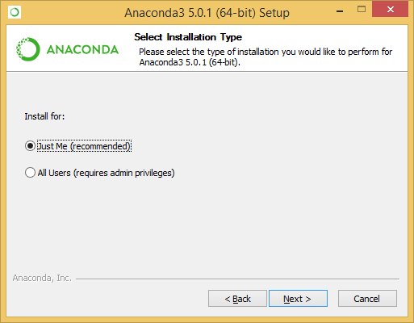
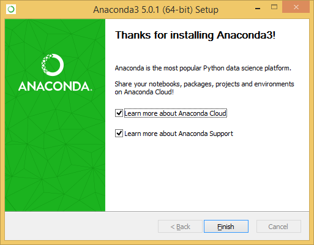
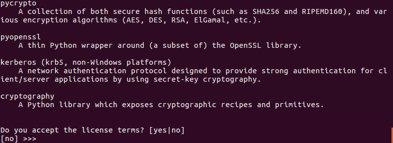
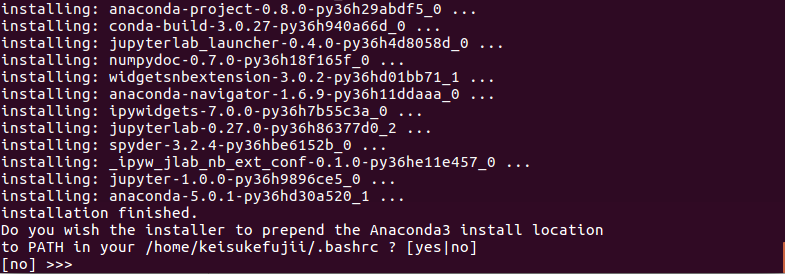
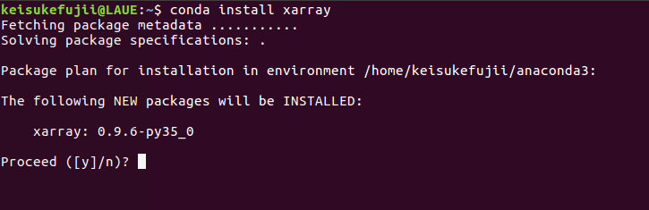
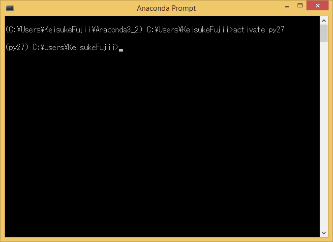
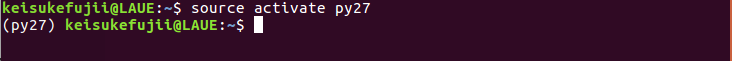
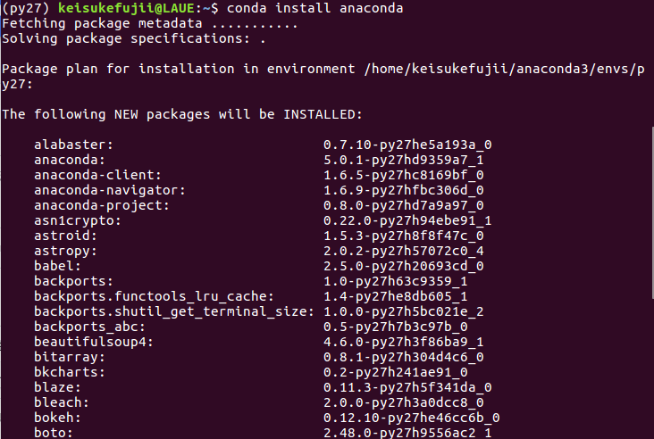

概要
=====

Pythonは簡単に始めることのできる言語です。
開発環境をPC内に構築することも容易で、
これまでプログラミングにほとんど触れたことのない人でも数クリックで環境構築を完了できることが特徴です。
ここでは、Python開発環境の構築法を述べた後、
少し発展的な話題として、
外部パッケージを新しくインストールする方法、
Python開発環境を一つのPC内に複数構築する方法について述べることにします。

Python開発環境の構築
=======================

これまでプログラミング環境の構築に手間取って、何時間もかけた記憶のある人も多いと思います。
しかし、Pythonはそうではありません。
本講座は「今日から始めるPython」と題している通り、
今日からPythonプログラミングを始めることを趣旨としています。
忙しい研究者の方々の時間を、環境構築などにかけてはいられません。
セットアップは5分で終わらせましょう。

この節では、
Windows, Mac および Linux 各オペレーティングシステム（OS）上での
Python開発環境の構築法について述べます。
開発環境をセットアップする方法も色々ありますが、
ここでは非常に簡単で人気のある Anaconda distribution という統合パッケージを利用することにします。

なお、Anaconda distribution の特徴や詳細については次節以降で述べます。
Pythonを触ったことのない初心者は、環境構築が完了すれば以降は飛ばして、
次章の Jupyter-notebook を用いたPython入門に進んでもよいでしょう。

Windowsでの開発環境構築
---------------------

まずは Anaconda distribution ダウンロードページ https://www.anaconda.com/download
にアクセスし、Windows版 Anaconda をダウンロードします。
なお、（残念ながら）Pythonにはバージョン2系（現在の最新は2.7）と3系（現在の最新は3.6）
という大きく2つのバージョン系列があります。
現在も開発続いているパッケージはほとんどが3系に対応しているため、こちらを利用することを勧めます。

OSのbit数などに合わせたバージョン（現在では64bitシステムが一般的である）をダウンロードしてください。
ダウンロードされたインストーラをクリックすることでインストールを開始できます。

.. figure:: figs/anacond_setup1.png
   :scale: 50 %
   :alt: download anaconda

  ダウンロードしたインストーラを実行している様子。

 インストール終了時のスクリーンショット

詳細は後述しますが、Anaconda ではPython開発環境をユーザー固有のもにするか
PC内で共通にするか選ぶことができます。
他のユーザと環境が衝突しないよう、個人ごとの環境を構築すること（上図のJust Meを選択）を勧めます。
インストーラが終了したあと、
Anaconda Prompt や Jupyter Notebook というアプリケーションがスタートメニューに登録されていれば
Python開発環境の構築は終了です。

Macでの開発環境構築
---------------------

https://www.anaconda.com/download/#macosにアクセスします。
執筆時点の Anaconda distribution のversion は 5.0.1です。
ウェブサイトでリンゴの画像をクリックすると
Python 3.6 とPython 2.7 のインストーラーが出てきますので迷わず、
3.6 versionをダウンロードします。
この際、Cheat Sheet (Starter Guide)が必要かと聞かれます。
必要な場合はe-mail addressを入力します。
Getして損はないでしょう。

その後はインストーラーを起動し、基本的に続けるボタンを押し、
最後にインストールボタンを押せばインストール完了です。
ここで

.. code-block:: bash

 which python

とすれば

.. code-block:: bash

 /Users/inagaki/anaconda/bin/python

となり、DefaultのpythonがMacOSのnativeのpython (バージョン2.7)から
Anaconda の Python へと変更されている事が分かります。

なお、既にhomebrewをインストールしている場合、
anacondaとの衝突を避ける為pyenvを先にインストールした方が良いようです。

.. code-block:: bash

 brew install pyenv
 pyenv install --list

でインストール可能なpythonの一覧が出てきますのでその中からanaconda3-*.*.*を探し、

.. code-block:: bash
 pyenv install anaconda3-*.*.*

とします。

Linuxでの開発環境構築
-----------------------

Anaconda distribution ダウンロードページ https://www.anaconda.com/download にアクセスし、
Linux版 Anaconda をダウンロードしてください。

Anaconda3-5.0.1-Linux-x86_64.sh というようなファイル名
（5.0.1 などの数字はAnaconda distributionのバージョン番号）
のスクリプトファイルがダウンロードされます。
以下のようなコマンドを用いて、実行権限を付与して実行してください。

.. code-block:: bash

  chmod +x Anaconda3-5.0.1-Linux-x86_64.sh
  ./Anaconda3-5.0.1-Linux-x86_64.sh

なお Linux 版 Anaconda でも、OSのPython環境と切り離した環境を構築することが可能です。
そのため上記コマンドは、管理者でなく一般ユーザーの権限で実行することをおすすめします。
ライセンスに同意すれば、インストールが始まります。

 ターミナルからインストーラを実行している時の様子。ライセンス同意書に同意することでインストールが始まります。

 Anaconda を Path に加えるかを問われている画面。ここで yes を選択しておくとよいでしょう。

最後に Anaconda を Path に加えるか問われるます。ここで yes を選択しておくとよいでしょう。
これによりターミナルからPython を実行する際にAnacondaのPythonが優先して選択されることになります。
なお、ディストリビューションによっては 一度ログインし直す必要があるかもしれないので注意してください。

以上でLinuxにおけるPython開発環境の構築は終了です。

Anaconda distribution
===========================

上で紹介した Anaconda distribution は Anaconda Inc が開発する
Python および R 開発環境を提供するオープンソース・ソフトウェアです。
3-clause BSD License で提供されており、自由に利用することができます。

Anaconda distribution の主な特徴に

- 優れたパッケージ管理システム
- 簡単な仮想環境の構築

が挙げられるでしょう。これらの特徴により、Anaconda distribution は
Pythonの開発環境として広く用いられています。
これらの特徴は、実際非常に約にたつので、以下に簡単に紹介します。

外部パッケージのインストール
----------------------------

Python の基本的な機能だけで実現できることは以外と少なく、
実際にはほとんどの操作を外部のパッケージを用いて行うことになるでしょう。
本講座でデータ解析を行う時も Numpy や Matplotlib など他のパッケージを用いることになります。

様々なプログラミング言語のなかでも Python は特に外部パッケージが豊富であり、
そのインストールも非常に簡単に行うことができます。
現在10万種類を超える多種多様なパッケージが公開されており、
Numpy, Matplotlib を含めたこれらパッケージのほとんどはオープンで開発が行われています。
読者の方々も、プログラミング開発に習熟すればこれらの活動に参加・貢献することも可能となるでしょう。

上述の通りに Anaconda distribution をインストールすれば、
Numpy, Matplotlib を含めた基本的なパッケージは自動的にインストールされます。
しかし、Python に慣れてくれば、より専門的なパッケージを用いることも多くなると思います。
そういった時には、新たにそれらのパッケージをインストールする必要があります。

ここでは例として、のちの3章で紹介する 多次元データ処理ツールである ``xarray`` を
新たにインストールすることを考えます。
なお、少し詳細になりますが、
Anaconda環境でパッケージをインストールする方法は大きく2つあります。

- Python の持つパッケージインストールコマンド ``pip`` を用いる方法
- Anaconda の持つパッケージインストールコマンド ``conda`` を用いる方法

以下で少し触れるように、``conda`` の方が高機能でありこちらを用いるほうがよいでしょう。
``conda`` コマンドで新たなパッケージをインストールするためには、以下のコマンドを実行してください。

.. code-block:: bash

  conda install xarray

 xarray を conda コマンドにより実行している様子。

これにより Python 環境に ``xarray`` がインストールされます。
なお、 ``xarray`` は別のパッケージである ``pandas`` を内部で用いています
（依存関係がある）が、そういった必要なパッケージも自動的にダウンロード・インストールされます。

インストールしたパッケージをバージョンアップするには

.. code-block:: bash

  conda update xarray

アンインストールするには

.. code-block:: bash

  conda uninstall xarray

を実行すればよいでしょう。
また、現在の環境にインストールしているパッケージの一覧を確認するには、以下を実行してください。

.. code-block:: bash

  conda list

その他のコマンドについては、Anacondaのマニュアルページ
https://conda.io/docs/user-guide/tasks/manage-pkgs.html
を参考にしてください。

Anaconda による パッケージ管理
-----------------------------

Python は他言語との連携が容易であり、それを前提としたパッケージも多数存在します。
例えば、Pythonの最も基本的な数値計算パッケージである Numpy は、主にC言語で書かれており
それをパッケージ内部から呼び出しています。
さらにNumpyは、Intelが提供する並列計算ライブラリMKLとの連携しており、
行列計算などは自動的に並列化しています。
他にも、データベースを操作する PostgreSQL など
実際には別の言語で書かれているパッケージも数多くあります。

Python自体はクロスプラットフォームな言語なので、OS環境には依存しません。
Windowsで作成したスクリプトをほとんど何も改変せずにMacで動かすことも可能です。
しかしC言語やFortranなどで OS のコンパイラを用いる場合や、並列化計算を実現するためには
その実装はOSに依存したものとなってしまいます。
Anaconda は各プラットフォームに合わせたバイナリ・コンパイラを提供しており、
conda コマンド一つで、それらパッケージのダウンロード・コンパイル等、
必要なことを自動的に行ってくれる仕組みになっています。
そのためユーザーは、OSの違いを気にすることなく、パッケージをインストールしたり、
実行したりできるようになっています。

Anaconda による Python仮想環境
-----------------------------

Anaconda によって構築した Python 開発環境は、OS内の環境とは独立した仮想環境になっています。
例えば Anaconda内でパッケージをインストールしても、OSの環境、他のユーザの環境に影響を与えません。
そのため、管理者権限を持たないコンピュータ上にも
ホストPCの環境を崩さずに開発環境をインストールすることができます。
さらに、ユーザー各自が好きなパッケージをインストールすることができるため、
個人のPCだけでなく、共同で用いる計算サーバでの利用にも適していると言えるでしょう。

もっと言うと、このような仮想環境を1つのPC内に複数構築することも可能です。
例えば研究を進めていくと、
あるパッケージの古いバージョンでしか実行できないの古いプログラムを使いたい
といった場合も出てくるでしょう。
通常であれば、PC内のそのパッケージのバージョンを全て古いものに戻す必要がありますが、
そうしてしまうと、
これまで開発してきたスクリプトが動かなくなるなど移行へのトラブルが想定されます。

また、先述したとおりPythonには2系統 と 3系統の2つのバージョンが存在します。
現行のほとんどのパッケージは両系統に対応していますが、
開発が止まっている古いパッケージには Python2 のみしかサポートしないものもあり得ます。
そのようなパッケージを使う場合に、PC全体のPython環境をバージョン2へ戻すのは、
他のパッケージが動かなくなるなどのリスクがあります。

こういった場合には、これらのプログラムを動かす環境を
普段使っている環境と隔離した仮想環境として構築することが有効でしょう。
ある仮想環境でインストールしたパッケージは他の環境に影響を与えないため、
その古いパッケージ専用の仮想環境を用意すれば、安全に利用することが可能です。

他にも

- 自分の開発しているスクリプトが、他の環境でどのように実行されるか知りたい
- 普段使っているものとバージョンの異なるパッケージをインストールしたい

など、仮想環境が有効であるシーンは意外と多いです。

Anacondaでは、以下のコマンドを実行することで Pythonの仮想環境を構築することができます。

.. code-block:: bash

  conda create -n py27 python=2.7

このコマンドは、Python 2.7 が動く ``py27`` という名前の仮想環境を作る、という意味です。
このようにして作成した仮想環境 ``py27`` をアクティブにするには、
Windowsでは以下を

.. code-block:: bash

  activate py27

Mac, Linuxでは以下を実行してください。

.. code-block:: bash

  source activate py27

 Windows で仮想環境 py27 をアクティブにする様子。

 Linux で仮想環境 py27 をアクティブにする様子。

コマンドプロンプト・ターミナルに ``(py27)`` と表示されている思います。
これは ``py27`` 仮想環境がアクティブになっていることを示す表示です。

なお、上記コマンドで作成した仮想環境には、Numpyなどのパッケージはインストールされていません。
以下に述べた方法によりパッケージのインストール・アンインストールすることが必要です。
必要な
Numpyなどの基本的なパッケージ群は以下のコマンドで一括してインストールすることが可能です。

.. code-block:: bash

  conda install anaconda

 基本的なパッケージ群をインストールする
 ``conda install anaconda`` を仮想環境 py27 において実行している様子。

この仮想環境を非アクティブ化するには
Windowsでは以下を

.. code-block:: bash

  deactivate py27

Mac, Linuxでは以下を実行してください。

.. code-block:: bash

  source deactivate py27
