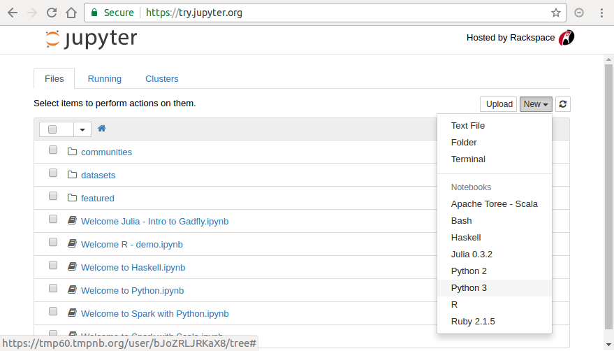

対話的開発環境 Jupyter-notebook
===============================================

本章では対話的プログラミング環境の1つである Jupyter-notebook を紹介する。
Jupyter-notebook は

+ 実行結果を可視化しながらデータ解析を進めることができる
+ ソースコード、実行結果、グラフ、数式、文書を１つのファイルに保存することができる

などが特徴であり、近年利用が広まっている。

.. 歴史

元々 Jupyter-notebook は IPython というPythonの対話的プログラム環境の一部の
IPython-notebookとして開発が進められてきたが、
その有用性が認められ、現在はPythonに限らず
Julia, R, ruby など他のインタープリタ言語でも利用可能な
汎用ソフトウェアとして開発が続けられている。

上記の特徴は、試行錯誤しながらすすめる研究活動を行うのに効果的なだけでなく、
研究成果をデータ・解析コード・結果をまとめて公開するのにも有用である。
例えば、2016年に重力波が初めて発見された時の計測データ・解析プログラムは
https://losc.ligo.org/s/events/GW150914/GW150914_tutorial.html
に Jupyter-notebook 形式で公開されており、
誰でもその結果を追試することができる。
さらにソースコードの実行結果をすぐに可視化できることは、
プログラムスキルを身に付けるためにも非常に効果的である。

----------------------------------------
Jupyter-notebookを体験する
----------------------------------------

本講座で紹介したPython環境の１つであるAnacondaにはすでにJupyter-notebookは含まれており、
前章に従って環境を整えた読者はすぐに利用が可能である。
さらに、インストールがされていない環境からもその使用感が体験できるサービスが用意されている。
ウェブブラウザで
https://try.jupyter.org/
にアクセスすると、図1のようなページが表示される。

   http://try.jupyter.org のトップ画面。右上の New ボタンから新しいノートブックファイルを作成できる。

右上の New ボタンから Python 3 を選択すると、
新しいノートブックファイルが作成され、図2のような新しいノートブックページが開かれる。

.. figure:: figs/try_jupyter_start.png
   :scale: 50 %
   :alt: blank notebook

   新しいノートブックファイルを作成したときの様子。

Jupyter-notebook では、セルと呼ばれるボックス内にスクリプトを入力する。
スクリプトはセル単位で実行することができる。
まずは、図3にあるように、ひとつ目のセルに以下を入力してみよう。

.. code-block:: python

  print('Hello world!')

このセルを実行するためには、再生ボタンを押すか、
キーボードの Shift + Enter を同時に押下すればよい。

実際に実行すると、入力したセルの下に"Hello world!" が表示される。
C言語などのコンパイル言語でこのような命令を実行するためには、
まずは完全なソースコードを作成し、コンパイルして実行ファイルを生成することが必要である。
一方でインタープリタ言語である Python ではコンパイル作業が不要であるほか、
開発途中のソースコードでも途中まで実行できる点が特徴である。

内容は後ほど説明するので、まずは図3のように以下の内容を入力してみよう。

.. figure:: figs/try_jupyter_plot.png
   :scale: 50 %
   :alt: example of jupyter-notebook

   ノートブックファイルの実行例

.. あ

  .. code-block:: python

    import numpy as np
    import matplotlib.pyplot as plt

  .. code-block:: python

    x = np.linspace(-10,10,21)
    x

  .. code-block:: python

    y = np.exp(-x*x / 2)
    y

  .. code-block:: python

    plt.plot(x, y)

上記では、ベクトル変数 x と y を定義し、
その内容を画面に表示したあと、グラフに描画している。

セルの操作
----------------------------------------

Jupyter-notebook には、セルという概念がある。
上記でスクリプトを記入したボックスがセルである。
以下の3種類のセルが提供されている。

 1. コードセル (Code cell)
 2. マークダウンセル (Markdown cell)
 3. テキストセル (Raw NBconvert cell) (本章では説明しない)

セルの種類は、ツールバーの Cell > Cell type から変更することができる。
マークダウンセルでは、ノートブック内にマークダウン記法により、
構造化された文章、例えば見出しや数式などを記録できる。

以下のようにマークダウンセルを追加してみよう。
Cell > Cell type からマークダウンセルを選択する。
セル内に

.. code-block:: none

  Y is a Gaussian function with 0 mean 1 standard deviation
  $$
  Y = \exp \left\[ - \frac{-x^2}{2} \right]
  $$

を記入し、同様にセル内で Shift + Enter を押下する。
文章と数式が表示されたと思う。
本講座ではマークダウンについての説明は省略するが、かなり単純化されたHTMLやTeXを想像すればよい。
特にこのマークダウンセルは、
ノートブックを公開する時などデータ解析の内容を詳細に記述するときに重要である。
現に、上記の重力波検出データのノートブックでは、マークダウンセルが半数以上を占める。

このようにJupyter-notebookは変数などの状態を簡単に可視化しながら、
プログラムの開発・データの解析が可能であり、
さらにそのデータ解析の様子をデータ・コード・結果・文書をまとめて記録することが可能である。

----------------------------------------
Jupyter-notebookのインストール
----------------------------------------

本講座で紹介したPython環境の１つであるAnacondaには、
すでにJupyter-notebookが含まれている。

インストールされていない別の環境などはターミナルから

.. code-block:: bash

  pip install jupyter-notebook

を実行することでインストールできる。

----------------------------------------
Jupyter-notebookの起動と終了
----------------------------------------

Windowsでの起動
----------------------------------------

WindowsからJupyter-notebookを起動するための手順は、以下のとおりである。

 1. コマンドプロンプトを立ち上げる (必要に応じてディレクトリに移動する)
 2. 起動コマンド jupyter-notebook を入力する

これにより、自動的にブラウザが立ち上がり、Jupyter-notebookのホーム画面が表示される。

Mac、Linuxでの起動
----------------------------------------

Mac, Linuxの場合も同様に

 1. ターミナルを立ち上げる (必要に応じて適宜ディレクトリを移動する)
 2. 起動コマンド jupyter-notebook を入力する

上記操作を行うことで、図2と同様の画面がブラウザに表示される。
なお、ブラウザを誤って閉じてしまった場合も、

.. code-block:: bash

  http://localhost:8888

にアクセスすることで、Jupyer-notebookのホーム画面を再度表示できる。

ノートブックファイルの新規作成
----------------------------------------

Jupyter-notebook のホーム画面では、ディレクトリがツリー表示されている。
フォルダ間の移動、ファイル・フォルダの名前の新規作成・名前の変更・削除など、
シンプルなファイル操作はJupyter-notebook 内で一通りできるようになっている。
ディレクトリを適宜移動し、ノートブックファイルを新たに作成して学習を始めよう。

上記で体験したように、
右上の New から Python 3 を選択すると、
新しいノートブックファイルが作成され、図2のようなページが開かれる。
作成されるファイル名はデフォルトでは Untitled であり、ページの最上部に表示されている。
この部分をクリックすると図4のようにファイル名を変更するダイアログが表示される。
ここでは、python_tutorial と変更した。

Jupyter-notebook の終了
----------------------------------------

Jupyter-notebook には、
個別のノートブックファイル（カーネル）の終了とJupyter-notebook 自体の終了の2つがある。
カーネルとはPythonの実行を行っているソフトウェアのことであり、
オブジェクトの内容をメモリ格納していたり、何か計算をしていたりする。
ブラウザ画面を閉じるだけではカーネルは終了されない。
カーネルを終了するには、ツールバーの File > Close and halt を実行する。
もしくは、
Jupyter-notebook ホーム画面で Running タブを見ると、
カーネルが実行中であるノートブックファイル一覧が表示されるため、
そこで該当するノートブックファイルの shutdown ボタンを押すことで、
カーネルが停止され、メモリ内に格納されているデータなどが破棄される。

Jupyter-notebook 自体を終了するには、起動したコマンドプロンプトもしくはターミナルにて
Ctrl+C を実行する。
