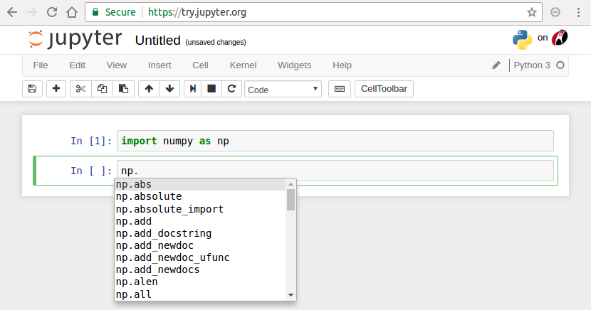
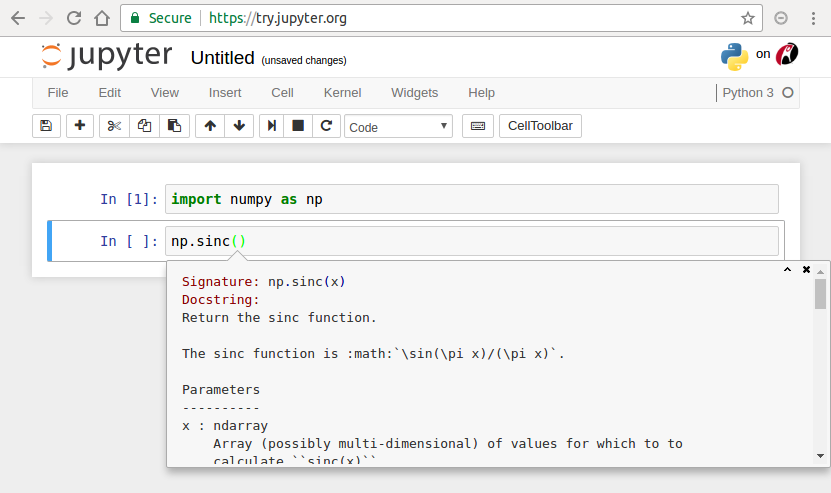

外部パッケージの使用
=============================

.. ipython:: python
  :suppress:

  import matplotlib.pyplot as plt

前節でも述べたように、多様なパッケージ（いくつかの機能をまとめたライブラリ）が
豊富に開発されていることがPythonの大きな特徴の1つです。

実際には生のPythonだけで用いることは少なく、基本的な数値計算機能を提供する Numpy [2]_ や
グラフ描画ライブラリである Matplotlib [3]_
を始めとして外部パッケージを多量に用いることになると思います。

.. [2] NumPy, NumPy developers, http://www.Numpy.org/
.. [3] Matplotlib, John Hunter, Darren Dale, Eric Firing, Michael Droettboom and the Matplotlib development team, https://matplotlib.org/

------------------------------------------
Numpy を利用する
------------------------------------------

Numpy や Matplotlib はデータ解析における最も基本的なパッケージです。
前節の方法に従って Anaconda をインストールした環境では、
これらは既にインストールされているので、すぐに使い始めることができます。

こういったパッケージを 各自で開発するスクリプトで用いるためには、
以下のような import 文によりその使用を宣言する必要があります。

.. ipython:: python

  import numpy as np

ここで ``import numpy as np`` は、「Numpy パッケージを ``np`` という名前で用いる」
という宣言です。
なお、 ``as`` の後ろの名前はユーザが勝手に決めてよいものですが、
混乱を避けるため、広く用いられている略称を用いることが望ましいでしょう。
Numpy の場合、 ``np`` が正式な略称です。
このようにしてインポートした後は、その機能を ``np.***`` という形で用いることになります。

Numpy は線形代数演算や特殊関数の計算など、
多くの基本的な数学操作を含む科学技術計算用ライブラリです。
多くのアルゴリズムは、これまで C や Fortran で開発されてきた Netlib [4]_ などのライブラリの
Pythonラッパーであるため、
非常に安定しているほか、CやFortranと同等の高速演算が可能です。

また、Anacondaからインストールした Numpy には
MKL [5]_ というインテルの数値計算ライブラリが同梱されています。
行列計算などは自動的に並列化されるため、
並列化されていないFortran、Cプログラムよりも高速に実行できることもあります。

.. [4] The Netlib, http://www.netlib.org/

.. [5] Intel, MKL, https://software.intel.com/en-us/mkl

Numpy の代表的な関数
------------------------------------------------------------------

Numpy を用いることで、多くの種類の算術演算を行うことができます。
例えば sin 関数は以下のようにして用います。

.. ipython:: python

  x = np.sin(0.5 * np.pi)
  x

Numpy では非常に多くの種類の関数やクラスが用意されています。
そのためどのような関数が用意されているかを把握することも難しく、
それらの使用法をすべて暗記することはほとんど不可能でしょう。

Python などのオープンソースソフトウェアでは、
開発に際して、使用法などの文書を同時に残していく文化が形成されており、
ユーザがある関数の使い方を知りたいと思った場合もすぐにその情報にアクセスできるようになっています。

Jupyter-notebook では、以下のように ``np.`` まで記入してから Tab を押下すると、
``np.`` 内にある関数一覧が表示されるほか、``np.s`` まで記入してから Tab を押下すると
それに合う候補を表示してくれます。
また、使用法がわからない関数でも、カーソルが括弧内にあるときに
Shift + Tab を押下することで、
それぞれの関数の使い方に関する文書（docstringsと言う）を表示させることができます。
そのため、新しい関数でもその使い方をすぐに理解することができるでしょう。

   Jupyter-notebook のサジェスト機能の様子。``np.`` まで入力してから、Tab を押すことで
   ``np`` パッケージ内でアクセスできるものが表示できます。

   Jupyter-notebook による docstring 表示の様子。
   関数内部（括弧``()``の内側）で Shift + Tab を入力することで、
   関数名、引数、docstringを表示できます。

さらに、科学技術用途以外も含め Python は広く用いられている汎用言語なので、
インターネットで検索するだけでも多くの情報を見つけることができるのも特徴です。

多次元配列型 np.ndarray
------------------------

Numpy は、多次元配列用のクラス（クラスについては後で少し紹介します）である ``np.ndarray`` を提供しています。
（なお、"nd"array は、n-dimensional の略です）。
``np.ndarray`` は配列の大きさを後から変更できない、
全ての要素の型が同一なものに限られる、という点はリストと異なりますが、
同様にインデクシング・スライシングに対応しています。

``np.ndarray`` は、多次元配列の基礎となるクラスで、
線形演算を含む多くのNumpy関数で利用する他、
pandas など他のライブラリでも広く利用されている基本的なオブジェクト形式となっています。
詳しくは3章で紹介しますが、ここではその利用法について簡単にだけ触れることにします。

``np.ndarray`` を定義するためには、``np.ndarray`` から用意するか、
``np.ones`` や ``np.linspace`` などの関数を用いることになります。

.. ipython:: python

  # [5 x 3 x 2] の大きさの配列をxとして確保する。
  x = np.ndarray((5, 3, 2))

  # [2 x 3] の大きさで、要素がすべて１のint型の配列をyとして確保する。
  y = np.ones((2, 3), dtype=int)
  y

``np.ndarray`` とスカラー、``np.ndarray`` 同士の計算は、要素ごとの計算として定義されています。

.. ipython:: python

  y * 3

  y + y

また、``np.abs()`` や ``np.square()`` などスカラーを引数に持つ関数に渡した場合は、
要素ごとに該当する演算が行われた ``np.ndarray`` が返されます。

.. ipython:: python

  np.sin(y)

------------------------------------------
Matplotlib を利用する
------------------------------------------

Matplotlib は、広く用いられているグラフ描画ライブラリです。
Matlabのグラフ描画機能を参考にして開発されたようで、よく似た命名規則を持っています。

Matplotlib の詳しい使い方自体も次章に譲ることにして、ここでは単純な描画方法についてのみ述べます。
Jupyter-notebook内で Matplotlib を表示するには、以下を宣言します。

.. code-block:: Python

  import matplotlib.pyplot as plt
  %matplotlib inline

``import matplotlib.pyplot as plt`` は、
matplotlib パッケージの中の pyplot モジュールを plt という名前で用いる
という意味です。
また ``%matplotlib inline`` は Jupyter-notebook 用のコマンドであり、
コードセルのすぐ下に ``Matplotlib`` の図を表示させるためのものです。
なお、パッケージ、モジュールなどの厳密な定義は、後の「Pythonの階層構造」を参考にしてください。

Matplotlibの最も基本的な用法は、１次元データを表示することです。

.. ipython:: python

  x = np.linspace(0,1,11)  # 0 ~ 1 を11等分した要素を持つ np.ndarray を返す関数
  y = np.sin(np.pi * x)

  @savefig tutorial2_plot1.png width=4in
  plt.plot(y)

``plt.plot`` の引数に１次元データを渡すことで、
横軸が要素番号、縦軸が要素の値のグラフを描画できます。
