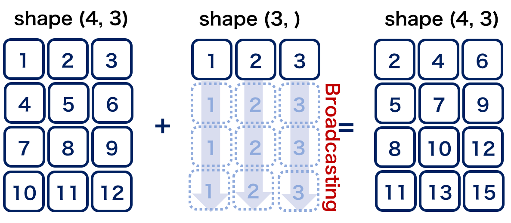

NumPy/SciPyを用いた実験データ解析
==================================
NumPy/SciPyを使う準備ができましたので，実際にプラズマ実験で得られたデータに対して解析をしてみましょう．
ここでは，東京大学が所有する磁気圏型プラズマ装置RT-1 [RT-1]_ において得られた2視線のマイクロ波干渉計のデータを例にします．
なお，今回解析対象とする実験では，変化が分かりやすいように時刻 *t =* 2.0 secに5 msec間のガスパフ入射を行っています．

実験データの読み込み
^^^^^^^^^^^^^^^^^^^^^^^^^^^^^^^^^^
まずは実験データを読み込んでNumPyの配列を生成します．
NumPyではファイル形式にバイナリとテキストを選びファイルの読み書きを行うことができますが，ここでは ``np.loadtxt`` を使用してテキスト形式で保存されている実験データを読み込んでみます．

.. ipython:: python

    IF = np.loadtxt("data/IF_20170608_74_raw.txt", delimiter=',')

NumPyにおけるテキスト形式での読み書きには，以下の特徴があります．

* 他のアプリケーションと互換性のある.dat, .csv, .txt形式のファイルの読み書きができる
* 保存できる配列の次元は２次元まで

なお，NumPyではテキスト形式以外にも，バイナリ形式の読み書きにも対応しています．
バイナリ形式の読み書きには， ``np.load`` ,  ``np.save`` ,  ``np.savez`` ,  ``np.savez_compressed`` を使います．
これらの関数は３次元以上のndarray配列も効率的にそのまま保存できますが，扱うファイル形式（.pickle, .npz, .npy）に他のアプリケーションとの互換性が殆どないことに注意が必要です．
バイナリ形式での読み書きに関する詳細は，公式HP [IO]_ を参照して下さい．

読み込んだデータの確認のため，
Pythonで広く用いられるグラフ描写ライブラリであるMatplotlibを使って，グラフに表示してみます．
Matplotlibの詳細は次章に譲るとして，ここでは以下のようにMatplotlibを読み込んでおきます．

.. ipython:: python

    import matplotlib.pyplot as plt
    @savefig numpy_scipy_IF.png width=4in
    plt.plot(IF)

配列の生成
^^^^^^^^^^^^^^^^^^^^^^^^^^^^^^^^^^
次に，この配列に時間軸を作ることを考えます．
時間軸のような等差数列の生成には， ``np.arange`` や ``np.linespace`` を使用します．
なお，RT-1のマイクロ波干渉計では，時刻 *t =* 0.5 secから *t =* 4.5 secまで，サンプル周波数10 kHzでデータ収集を行っています．

.. ipython:: python

    sampling_time = 1.0e-4
    delay = 0.5
    sample_length = 4
    time = np.arange(delay, delay+sample_length, sampling_time, dtype=np.float)

ここで，時間軸などの生成によく利用することになる ``np.arange`` と ``np.linspace`` の使い方を簡単に紹介します．

numpy.arange
------------------------
``np.arange`` は，連番や等差数列を生成します．
使い方はPythonの組み込み関数rangeと似ており，以下のように引数を取ります．
なお， ``[]`` で囲んだ引数は省略できるということを意味します．

``arange([start,] stop, [step,][, dtype])``

``start`` で指定した数から ``stop`` で指定した数まで， ``step`` 間隔の数字列を生成します．
第２引数 ``stop`` 以外は省略ができますが，第３引数 ``step`` を指定するときは同時に第１引数 ``start`` も設定する必要があります．
なお，第２引数 ``stop`` だけを指定した場合は，初項0で交差1の等差数列を要素とするndarrayを生成します．

numpy.linspace
------------------------
``np.linspace`` は等差数列を生成する関数です．
同様の関数として先程紹介した ``np.arange`` がありますが， ``np.linspace`` を使用すると指定した区間をN等分した配列を生成しているということが明確になります．

``linspace(start, stop, num=50, endpoint=True, retstep=False, dtype=None)``

の形で使用し，生成する等差数列の始点と終点を ``start`` と ``stop`` で指定します．
第３引数 ``num`` で配列の長さを，第４引数 ``endpoint`` で終点を配列の要素として含むかどうかを指定します．

配列の演算
^^^^^^^^^^^^^^^^^^^^^^^^^^^^^^^^^^
データを読み込んで配列が生成できたところで，計測信号の較正値を適応して
干渉計の位相信号を密度の値に変換し，そこからオフセットを差し引きます．

NumPyではndarrayで表現した行列に対して，行列の和・積，逆行列の計算，行列式の計算，固有値計算などさまざまな計算を行うメソッドや関数が用意されています．
ここで，行列計算ではndarrayの ``+`` （和）， ``-`` （差）， ``*`` （積）， ``/`` （除算）， ``**`` （べき乗）， ``//`` （打ち切り除算）， ``%`` （剰余）は要素同士の計算になるという点に注意が必要です．
行列積を計算するには， ``dot`` メソッドを使うか， ``@`` 演算子（Python3.5以上かつNumPy1.10以上）を使う必要があります．

今回の例では，まず較正係数を適応して信号値を位相差の値に変換します．

.. ipython:: python

    a1 = -0.005
    a2 = 0.000
    b1 = 0.135
    b2 = 0.300

    IF[:, 0] = np.arcsin((IF[:, 0]-a1)/b1)*180/np.pi
    IF[:, 1] = np.arcsin((IF[:, 1]-a2)/b2)*180/np.pi

次に，位相差を線積分密度の値に変換します．

.. ipython:: python

    IF = IF*5.58/360

最後に，プラズマのない時間帯の値をオフセットとして差し引きます．

.. ipython:: python

    IF -= np.mean(IF[:5000, :], axis=0)

始めに作成した時間軸の配列とともにグラフに表示してみます．

.. ipython:: python

    plt.plot(time, IF[:, 0]);
    plt.plot(time, IF[:, 1]);
    plt.xlim(1.0, 3.0);
    plt.ylim(0.0, 2.0);
    plt.xlabel('Time [sec]');
    @savefig numpy_scipy_IF.png width=4in
    plt.ylabel('$\mathbf{n_eL [10^{17}m^{-2}]}$')

上記で用いた ``IF[:5000, :]`` では， **インデキシング** という処理によりプラズマがない時間帯の2視線の干渉系信号を切り出しています．
``[]`` の中身の意味ですが，左側の　``:5000`` で配列IFの第0軸（この場合は時間方向に相当）の先頭から5000番目までの部分を示し，右側の ``:`` では第1軸全体（この場合は2視線の干渉系信号）を示しています．

切り出した配列に対し ``np.mean`` では， ``axis`` でどの軸（axis）に沿って平均を求めていくのかを決めています．
今回は各視線ごとの平均値を求めることが目的のため， ``axis=0`` として行方向，つまり列ごとの平均を求めています．

``np.mean`` により各視線のオフセットがスカラー値として求められており， ``IF -= np.mean(...)`` の処理でこの値を配列IFから差し引いています．
更に，その後の処理では較正係数を適応するために，干渉計の各視線の配列とスカラーの較正係数の引き算，除算を行っていますが，
本来は要素ごとに計算を行いたくても要素の数が異なりこのままでは実行できないため， **ブロードキャスティング** と言う処理を行っています．
ここで，NumPy/SciPyによる配列演算の理解のために， **インデキシング** と **ブロードキャスティング** という概念を紹介します．

インデキシング
------------------------

NumPyでは，インデキシング（Indexing）という処理により，配列の任意の要素・行・列を切り出すことができます．
ただし，切り出し方によりコピーを生成するかビュー（参照）を生成するかという違いがありますので注意が必要です．
本講座の2章で紹介したように，Pythonのリストやタプルにも実装されているスライシング（Slicing）をndarrayに対して行うと，その部分配列がビューとして返ってきます．
つまり，その部分配列はデータの一部のコピーではなく，部分配列に対する変更はオリジナルのndarrayを変更するということです．

試しに，１列目の干渉計のプラズマ着火前の信号を抜き出してみます．

.. ipython:: python

   IF_slice = IF[:5000, 0]

IF_sliceの中身を0に変更してみます．

.. ipython:: python

    IF_slice[:] = 0
    IF[:5000, 0]

この例では，配列IF_sliceはビューですので，元の配列IFに変更が反映されています．

他の配列指向の言語ではスライスのようなデータ片はコピーとして生成する仕様のものが多いため，このインデキシングの仕様に驚く方は多いと思います．
NumPyの目的の一つは大量データ処理ですが，ビューを生成することで元のndarrayのコピーがメモリ上に作成されないため，大きなデータを保持するndarrayのビューを生成してもメモリの使用量はそのビューを保持する分しか増えないというメリットがあります [#]_ ．

ブロードキャスティング
------------------------

``+-*/`` 等の四則演算や，ユニバーサル関数を使ってndarray同士の演算を行う際に，異なるサイズの２つのndarrayを使って計算を行わなければならないことがあります．
そのような状況で，処理の効率化のためにNumPyが備える配列演算の拡張ルールであるブロードキャスティング（Broadcasting）により，配列の形状を合わせて効率的に処理を行うのが計算を行える場合があります．

ここでは，ブロードキャスティングの一例を紹介します．

.. ipython:: python

    #1から12までの等差数列を作成し，形状を(4, 3)に変更する
    b = np.arange(1, 13, 1).reshape((4, 3))
    b

    c = np.array([1, 2, 3])
    c.shape #cの形状(shape)を確認する

    b + c

NumPyには，ブロードキャスティングにより配列の全要素に対して要素ごとに演算処理を行う，ユニバーサル関数が組み込まれています．
ユニバーサル関数はCやFortranで実装されており，かつ線形演算ではBLAS/LAPACKのおかげでC/C++と遜色のないほど高速に動作します．

Pythonのコードで良いパフォーマンスを得るには，以下の事が重要です．

* Pythonのループと条件分岐のロジックを，配列操作と真偽値の配列の操作に変換する
* 可能なときは必ずブロードキャストする
* 配列のビュー（スライシング）を用いてデータのコピーを防ぐ
* ユニバーサル関数を活用する

特に，Pyhonの言語仕様に慣れないうちはforループを多用しがちですが，
これらに気をつけるとPythonでも高速で動作するプログラムを作ることができます．

SciPyを用いたデータ解析
^^^^^^^^^^^^^^^^^^^^^^^^^^^^^^^^^^
時系列データの配列が完成したら，ようやく解析になります．
今回の例では，SciPyの信号処理に関するサブモジュールscipy.signalの中の関数spectrogramを用いて時間発展スペクトルを調べてみます．

.. ipython:: python

    import scipy.signal as sig
    f, t, Pxx = sig.spectrogram(IF[:, 0], fs=1/sampling_time, window='hamming', nperseg=250)
    @savefig numpy_scipy_fft.png width=4in
    plt.pcolormesh(t+0.5, f, np.log(np.abs(Pxx) + 1e-15))
    plt.xlim(1.5, 2.5);
    plt.xlabel('Time [sec]');
    plt.ylabel('Frequency [Hz]');

このように，SciPyを用いることで１行の記述のみでスペクトル解析を行うことができます．
SciPyパッケージには科学技術計算のための多様なツールボックスがありますので，プログラムを作る際はルーチンを実装する前に望んでいる処理がSciPyで既に実装されていないか確認してみましょう．
SciPyで実装済みのルーチンを用いることで最適化された効率の良いデータ処理を行うことができます．

解析データの書き込み
^^^^^^^^^^^^^^^^^^^^^^^^^^^^^^^^^^
最後に，物理量に変換した配列を時間軸と一緒にテキスト形式で保存します．

.. ipython:: python

    np.savetxt('time_IF.txt', np.c_[time, IF], delimiter=',')

ここでは，配列の結合に ``np.c_`` というオブジェクトを使用しています．
``np.c_`` は ``axis=1`` の方向（２次元の場合は列方向）に配列を結合しますが，
``axis=0`` 方向（２次元の場合は行方向）に結合するには ``np.r_`` を用います．
配列の結合には ``np.concatenate`` ,  ``np.hstack`` ,  ``np.vstack`` などの関数も用いることができますが，
``np.c_`` や ``np.r_`` の特徴としては，スライス表記で配列生成できること，スカラーも配列として結合できる事が挙げられます．
また，どちらも関数ではなくオブジェクトなので，全て ``[]`` の中に配列や値を入れて操作していきます．
``np.c_`` や ``np.r_`` について更に詳しく知りたい場合は，docstring等を参照して下さい [#]_ ．

.. [RT-1] Z.Yoshida *et al.*, Phys. Plasmas, **17**, 112507 (2010).
.. [IO] https://docs.scipy.org/doc/numpy-1.13.0/reference/routines.io.html
.. [#] スライスをndarrayの実コピーとして生成する場合には，明示的に ``arr2d[1, 1:].copy()`` のようにします．
.. [#] IPythonなどで ``np.r_?`` と呼び出してdocstringを確認することができます．
