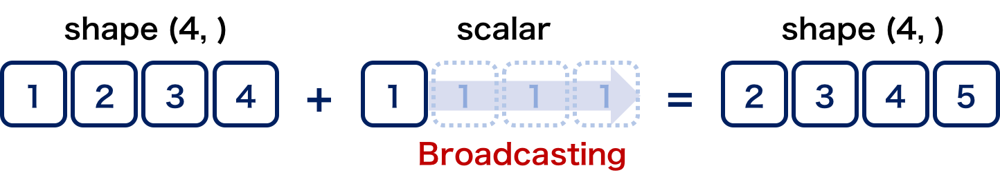
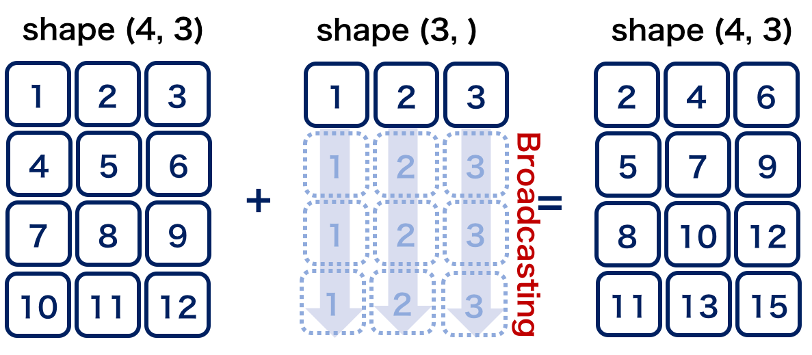
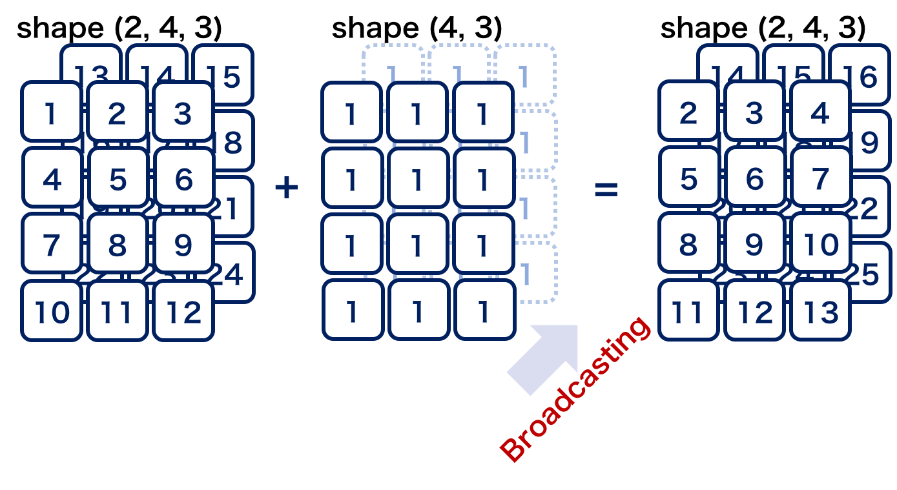

配列の演算
==================================
それでは，用意した配列に対して演算処理を行いましょう．
NumPyではndarrayで表現した行列に対して，行列の和・積，逆行列の計算，行列式の計算，固有値計算などさまざまな計算を行うメソッドや関数が用意されています．
行列計算では，ndarrayの ``+`` （和）， ``-`` （差）， ``*`` （積）， ``/`` （除算）， ``**`` （べき乗）， ``//`` （打ち切り除算）， ``%`` （剰余）は要素同士の計算になるという点に注意が必要です．
行列積を計算するには， ``dot`` メソッドを使うか， ``@`` 演算子（Python3.5以上かつNumPy1.10以上）を使う必要があります．

ブロードキャスティング
------------------------
``+-*/`` 等の四則演算や，ユニバーサル関数を使ってndarray同士の演算を行う際に，異なるサイズの２つのndarrayを使って計算を行わなければならない場合もあります．

.. 例えば，配列の要素同士の加算を行う時にそれぞれの配列の形状が合致していない場合があります．

そのような場合に，処理の効率化のためにNumPyが備える配列演算の拡張ルールであるブロードキャスティング(Broadcasting)により，配列の形状を合わせて効率的に処理を行うのが計算を行える場合があります．

ブロードキャスティングのルール
^^^^^^^^^^^^^^^^^^^^^^^^
ここでは，ブロードキャスティングの規則に関しては，簡単に説明します．
詳細は公式サイトを参照下さい [BC]_ ．

1. ブロードキャスト対象の配列の中で，次元数(ndim)が異なるときはshapeの先頭に1を追加して次元数を統一する
2. 各次元の要素数が最も大きい値に等しい，もしくはちょうど1となっている場合に，計算処理に用いる事ができる
3. 出力される配列のshapeは調整されたshapeのそれぞれの次元において最も要素数の大きいものに合わせられる
4. 要素数が１となっている次元の軸については，値はすべて同じものが繰り返される．
  
文章だけではイメージしにくいと思いますので，図とともに実例を示します．

.. ipython:: python

    a = np.array([1, 2, 3, 4])
    a.shape #aの形状(shape)を確認する
    a + 1

.. ipython:: python

    #1から12までの等差数列を作成し，形状を(4, 3)に変更する
    b = np.arange(1, 13, 1).reshape((4, 3)) 
    b

    c = np.array([1, 2, 3])
    c.shape #cの形状(shape)を確認する

    b + c

.. .. ipython:: python
.. 
..     #1から4までの等差数列を作成し，形状を(4, 1)に変更する
..     d = np.array([1, 2, 3, 4]).reshape(4, 1)
.. 
..     d + c
.. 
.. .. image:: broadcast3.png
..     :alt: IMAGE

.. ipython:: python

    #1から24までの等差数列を作成し，形状を(2, 4, 3)に変更する
    e = np.arange(1, 25, 1).reshape((2, 4, 3))
    e

    f = np.ones((4, 3)) #形状が(4, 3)ですべての要素が1の配列を作成する
    f

    e + f

SciPyによる行列演算
------------------------------

さらに，SciPyを使うとより高度な行列演算ができます．
これには，線形代数分野の各種関数を提供するlinalgサブパッケージを用います．
NumPyにもlinalgがありますが，SciPyのlinalgはこの機能をほとんどカバーし，かつそれ以外にも多くの機能を追加しています [#]_ ．
ここでは，そのうち一部を紹介します [#]_ ．

.. ipython:: python

    from scipy import linalg    #SciPyのlinalgサブパッケージをインポートする
    import numpy as np

    array = np.array([[1, 2], [3, 4]])
    inv_array = linalg.inv(array)   #逆行列の計算
    inv_array
    det_array = linalg.det(array)   #行列式の計算
    det_array
    norm_array = linalg.norm(array) #ノルムの計算
    norm_array

.. [#] SciPyのlinalgでは，逆行列計算や線形方程式を解くための関数に加え，固有値計算，行列の分解，行列の各種計算関数（行列の対数計算など），特殊行列関数などが提供されています．

.. [#] どの関数がNumPyとSciPyにおいて異なる実装の関数であるか，またはどの関数が同じ実装の関数であるかについては，SciPyをimportした際に読み込まれる__init__.pyというファイル(SciPyインストールフォルダの直下)を参照すれば詳細が分かります．

.. [BC] https://docs.SciPy.org/doc/NumPy/reference/ufuncs.html
